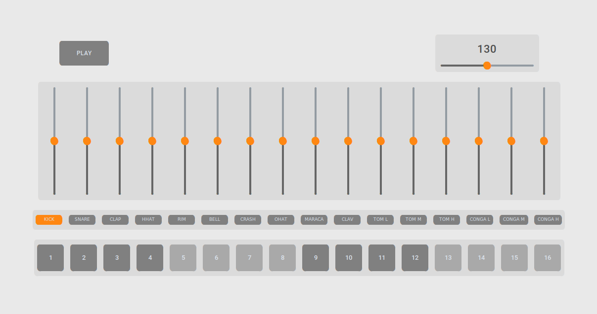

# PY-808

> [!TIP]
> See what PY-808 can do! - [Video Demonstration](https://www.youtube.com/watch?v=0TPWwug3g-M)

## About
PY-808 is a virtual drum machine based on the Roland TR-808 from 1980.  This program can be used as a metronome to maintain a steady beat while practicing an instrument or simply as a way to explore rhythm.  If you have never programmed a drum loop before, simply play around and see what you can come up with!

## Features
- 16 drum samples from the TR-808 drum machine
- 16 volume faders 
- Maximum of 16 possible layers 
- Infinite drum loop
- Adjustable tempo

## Instructions
- Select the drum sound you would like to sequence by clicking on its respective button 
- Click a step on the sequencer to determine where you would like that drum sound to play
- Click the play button to hear what your pattern sounds like
- Create other patterns with different drum sounds to add layers to your loop
- Adjust the volume of a drum pattern using the volume fader located directly above the labeled button
- Adjust the BPM of your loop using the slider located in the top right

## Install (Linux)
### Requirements 
- Python 3 
- Pygame 2.6.1
- customtkinter 5.2.2

### Setup
1. `git clone https://github.com/JackKaiser1/py-808`

2. `cd py-808`

3. `./main.sh`

